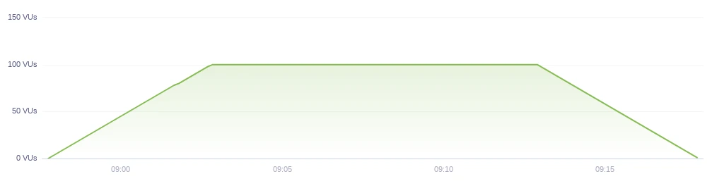

# K6 Load tests

# K6 Load tests

## Load Test

Load testing is primarily concerned with performance assessment.

You should run a Load Test to:

1. Assess the current performance of your system under typical and peak load.
2. Make sure you continue to meet the performance standards as you make changes to your system (code and infrastructure).

The VU chart of a typical load test looks similar to this



If your system crashes under a load test, it means that your load test has worked as Stress Test. And your system is not supporting the number of users that you want.

## Stress Test

Stress testing is concerned with system stability under extreme conditions

You typically want to stress test an API or website to determine:

1. How your system will behave under extreme conditions.
2. What the maximum capacity of your system is in terms of users or throughput.
3. The breaking point of your system and its failure mode.
4. If your system will recover without manual intervention after the stress test is over.

When stress testing, you configure the test to include more concurrent users or generate higher throughput than:

- Your application typically sees.
- You think your application can handle.

A classic example of a need for stress testing is "Black Friday”

The VU chart of a stress test should look similar to this:


## Soak Test

Soak testing is concerned with reliability over a longer period of time.

Reliability issues typically relate to bugs, memory leaks, insufficient storage quotas, incorrect configuration or infrastructure failures. Performance issues typically relate to incorrect database tuning, memory leaks, resource leaks or a large amount of data.

With a soak test you can simulate days worth of traffic in only a few hours.

You typically run this test to:

- Verify that your system doesn't suffer from bugs or memory leaks, which result in a crash or restart after several hours of operation.
- Verify that expected application restarts don't lose requests.
- Find bugs related to race-conditions that appear sporadically.
- Make sure your database doesn't exhaust the allotted storage space and stops.
- Make sure your logs don't exhaust the allotted disk storage.
- Make sure the external services you depend on don't stop working after a certain amount of requests are executed.

The VU chart of a Soak Test should look similar to this:


Soak testing helps you uncover bugs and reliability issues that surface over an extended period. Many complex systems have bugs of this nature.

You should execute soak tests after your standard load tests are successful, and your system has been found stable when executing a stress test.

## Let’s play with it! 🧑‍💻 🚀

### Install Pyenv

```
brew install pyenv
pyenv install 3.9.0
```

Inside project folder

```
python -m venv venv
source venv/bin/activate
```

### Application

A simple Flask Python API with 3 endpoints:

1. health_check
2. long_duration
    1. Endpoint with a longer process
3. short_duration
    1. Endpoint with a short process

We will use k6 to test this application.

### K6 Installation

[https://k6.io/docs/getting-started/installation/](https://k6.io/docs/getting-started/installation/)

```
brew install k6
```

### Running API

[api.py](api/api.py)

[requirements.txt](api/requirements.txt)

```
pip install -r requirements.txt
python api.py
```

### Running K6

[load_test.js](tests/load_test.js)
[stress_test.js](tests/stress_test.js)

```
k6 run load_test.js
k6 run stress_test.js
```
